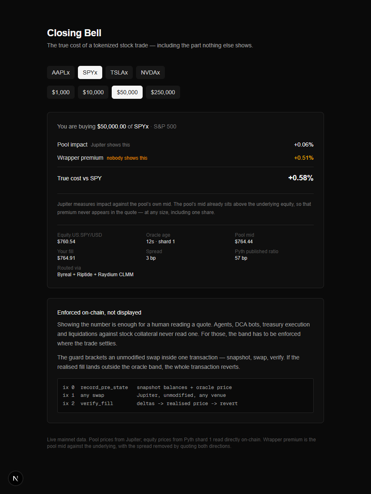

# Closing Bell

**A Solana program that refuses a tokenized-stock fill priced too far from the equity it
wraps — checked on-chain, at settlement, after the swap has already executed.**

Tokenized stocks trade at a premium to the shares they track. It is measurable, it
reproduces, and no quote anywhere shows it. Measuring that gap is the easy half, and
several tools now do it. The hard half is that a number on a screen only helps whoever is
reading the screen — so here the band is enforced inside a program, and a fill outside it
reverts.

Across the four wrappers this repo tracks, that comes to roughly **$600,000 of premium
inside $287m of circulating supply** — and not one quote displays a cent of it.

That figure applies each ticker's mean premium over 895 measurements to today's supply,
rather than a single probe. A single probe is not stable enough to quote: after hours, two
runs a minute apart have disagreed by 18 bp on TSLA and by $300,000 on the total. The
script prints both rows so the difference is visible rather than hidden, along with the two
caveats that matter — it is premium *carried* rather than losses taken, and circulating
supply includes the pools' own inventory.

```bash
npx tsx scripts/aggregate-premium.ts
```

**[Live demo](https://closing-bell-eight.vercel.app)** — the `/proof` page sends a real
devnet transaction on click and shows you the program rejecting it.



## The finding

Every xStock trades at a structural premium to the equity it wraps, because only
authorized participants can arbitrage redemption 1:1 and retail cannot. Pyth publishes the
ratio, but nothing on Solana applies it to a quote.

Measured 2026-09-18 against mainnet. The pool mid is isolated by quoting both directions at
the same notional, which cancels the spread: `mid = (buy_dev + sell_dev) / 2`.

| ticker | pool mid vs equity | Pyth published ratio | diff | spread |
|---|---|---|---|---|
| SPY | **+60 bp** | +57 bp | +3 | 3 bp |
| TSLA | **+2 bp** | 0 bp | +2 | 10 bp |
| NVDA | +19 bp | +9 bp | +9 | 10 bp |
| AAPL | +35 bp | +27 bp | +9 | 43 bp |
| GOOGL | +7 bp | +19 bp | −12 | 49 bp |

**Correlation 0.931 over n=5.** The discriminator is TSLA against SPY: TSLA's published
ratio is 1.00000 and its pool mid is +2 bp; SPY's is 1.00571 and its mid is +60 bp. A
feed-construction artifact would offset both alike. The premium is in the price people
actually trade at.

Jupiter measures impact against the pool's own mid, so the premium never appears in a
quote. A $50,000 SPYx buy shows **+0.06% impact** and costs **+0.58% against SPY** — the
invisible term is roughly ten times the visible one, and unlike impact it is present at
every size, including one share.

### It is a persistent state, not a number

The table above is one measurement per ticker at one moment, which cannot separate a
structural premium from whatever happened to be on screen. Sampling every three minutes
asks a better question — does each sample predict the next?

| tkr | premium | persistence (lag-1) |
|---|---|---|
| SPY | 53.9 ± 5.4 bp | **0.912** |
| AAPL | 27.9 ± 11.6 bp | **0.848** |
| NVDA | 11.9 ± 10.6 bp | 0.486 |
| TSLA | −4.0 ± 8.1 bp | **0.045** |

**TSLA is the control that makes the rest readable.** Every ticker carrying a premium
predicts itself three minutes later at ~0.85 to 0.91. TSLA, which carries none, sits at 0.05 —
indistinguishable from noise. The instrument finds structure where a premium exists and
finds none where it does not, which rules out the measurement itself as the source.

Two robustness checks:

- **Oracle staleness is not producing it.** Premium against the oracle's own age
  correlates −0.36 to +0.04. A stale-price artifact would be strongly positive.
- **Three samples discarded** by a stated 1% spread rule. One is a genuine after-hours
  route failure at a 36% implied spread; the other two are merely wide, at ~1.2%. The
  99th percentile of every other sample is 0.80%.

895 usable samples over **11.9 hours across four sessions**, as of 2026-09-22 — intraday
only, with no overnight or weekend coverage. The sampler is still running, so a fresh run
reports more samples than the table above. Reproduce with `npx tsx scripts/analyze-basis.ts`.

### We tried to explain it, and could not

The premium orders by dividend yield and is **exactly zero** for the one ticker in the set
that pays no dividend:

| tkr | AUM $m | liquidity $k | dividend yield | premium |
|---|---|---|---|---|
| SPY | 72.9 | 7,343 | 0.98% | 57.1 bp |
| QQQ | 60.8 | 1,808 | 0.40% | 27.3 bp |
| AAPL | 51.9 | 656 | 0.32% | 26.6 bp |
| GOOGL | 56.5 | 457 | 0.23% | 19.3 bp |
| NVDA | 70.6 | 2,065 | 0.46% | **9.2 bp** |
| TSLA | **83.6** | 1,345 | 0.00% | **0.0 bp** |

Correlation with dividend yield is **0.887**, against **−0.235** for AUM and 0.780 for
liquidity. Size and demand are ruled out by TSLA: the largest wrapper in the set by AUM,
with healthy liquidity, carries a premium of exactly zero.

But the dividend story does not close either:

- **SPY's ex-dividend date fell inside the build window.** A ~$1.90 dividend on a $759
  spot predicts a **~25 bp step** at the open — widening, for an accumulating wrapper.
  Measured across the open: **−5.4 bp.** SPY's spread is 3 bp, so a 25 bp step would have
  been unmissable. **No step.**
- **NVDA yields 0.46%**, more than AAPL or GOOGL, yet carries the smallest premium of the
  three. That inversion is unexplained.
- The implied accrual window clusters at **7–10 months** against a wrapper that launched
  roughly 14 months ago.

**The mechanism is unresolved. The premium is measured, reproducible, and not shown
anywhere.** The product does not depend on which explanation wins.

Reproduce: `npx tsx replay/pool-vs-equity.ts`

## The product

A Next.js app that prices the trade you are actually doing, against the asset you think you
are buying. Live mainnet data — Jupiter for pool prices, Pyth shard 1 read directly on-chain
for equity prices.

| page | what it shows |
|---|---|
| `/` | Overview — the headline breakdown for a reference trade |
| `/trade` | Calculator — pool impact vs. wrapper premium for any ticker and size |
| `/position` | A held xStock's true cost, looked up read-only by wallet connect or pasted address — never signs anything |
| `/proof` | The guard's devnet rejection, with a live "send a fill" button |
| `/findings` | The dividend-yield investigation, including the null results |

```bash
cd app && cp .env.example .env.local   # fill in an RPC URL at minimum
npm install && npm run dev
```

## Use it as an API

The premium is a number other tokenized-stock projects need and none of them compute. All
three endpoints are public, read-only, CORS-open and live — no key, no wallet, no signup.

```bash
curl "https://closing-bell-eight.vercel.app/api/truecost?ticker=SPYx&notional=10000"
```

```jsonc
{
  "oracle":    { "price": 773.56, "ageSecs": 13, "feed": "Equity.US.SPY/USD", "shard": 1 },
  "pool":      { "midPrice": 777.75, "fillPrice": 777.86, "venues": ["Raydium CLMM", "Byreal"] },
  "breakdown": {
    "poolImpactBps":     1.4,   // what your aggregator shows you
    "wrapperPremiumBps": 54.3,  // what nothing shows you
    "trueCostBps":       55.7
  }
}
```

| endpoint | method | params | returns |
|---|---|---|---|
| `/api/truecost` | GET | `ticker` (SPYx/AAPLx/TSLAx/NVDAx), `notional` (100–10,000,000 USD) | pool impact vs wrapper premium for that size |
| `/api/position` | GET | `address` (any Solana pubkey) | premium carried by that wallet's xStock holdings |
| `/api/guarded-swap` | GET | `ticker`, `notional`, `band` (0–1000 bps) | the oracle band, and whether a fill fits inside it |
| `/api/guarded-swap` | POST | same, plus `userPublicKey` in the body | an unsigned mainnet transaction carrying the band, or a refusal |
| `/api/guard/run` | POST | `mode` (`reject`/`allow`) | runs a real guarded fill on devnet, returns the signature |

`400` means the request was wrong and retrying will not help; `502` means a feed or route
could not be reached and retrying might. Responses carry a 15-second shared cache, which is
well inside the premium's own rate of change.

**If you are also building for Stocklana, take the number.** It costs one `curl`, and a
second independent implementation of this measurement is worth more to the finding than
exclusivity is worth to us.

## The dataset

`replay/basis-dense.jsonl` — every sample the basis sampler has taken, one JSON object per
line, at a three-minute cadence across four tickers:

```jsonc
{"t":1789776953,"sym":"NVDA","oracle":222.515,"oracleAge":955,
 "buyBps":18.17,"sellBps":11.49,"midBps":14.83,"spreadBps":6.66}
```

As far as we can tell, a public time series of the tokenized-equity basis at this cadence
does not exist anywhere else. It is committed rather than summarised because the mechanism
behind the premium is still unexplained, and the honest thing to publish alongside an open
question is the data that raised it.

```bash
npx tsx scripts/analyze-basis.ts        # persistence, dispersion, staleness confound
npx tsx scripts/aggregate-premium.ts    # premium across all circulating supply
npx tsx scripts/build-series-json.ts    # regenerate the chart on /findings
```

Both `error` rows and wide-spread rows are kept in the file rather than filtered at write
time, so anyone re-analysing it can choose their own exclusion rule instead of inheriting
ours.

## The program

Showing the number is enough for a human reading a quote. Agents, DCA bots, treasury
execution and liquidations against stock collateral never read one, so the band has to be
enforced where the trade settles.

The guard does not route swaps. It brackets one inside a single transaction:

```
ix 0   record_pre_state    snapshot balances + oracle price + band
ix 1   any swap            Jupiter, unmodified, real routing, any venue
ix 2   verify_fill         balance deltas -> realised price -> band check -> revert
```

Atomicity does the enforcement. The guard never moves a token, so Token-2022 extensions
cannot affect it, and it inherits real aggregated liquidity rather than needing a pool of
its own.

| | |
|---|---|
| Pyth read + band derivation | 3,369 CU |
| Full guarded fill | ~33,000 CU |
| Test suite | 8 cases, all passing |

### The same band, enforced on mainnet, with nothing deployed

The guard program is the trust-minimised path and it costs 2.76 SOL of rent to put on
mainnet, which this project does not have. So there is a second path that works today.

Every Solana swap already carries an on-chain minimum-output check: Jupiter's `route`
instruction reverts with `SlippageToleranceExceeded` when the fill lands below the
threshold. That threshold is normally derived from **the pool's own mid**, which is exactly
why the wrapper premium is invisible — a pool sitting 54 bp rich reports 0 bp of slippage,
because it is measuring against itself.

Derive the same threshold from the Pyth oracle instead and the primitive becomes an oracle
band. Nothing of ours runs on-chain; the router enforces our number.

```bash
# refuses: SPYx quotes ~50 bp above the oracle
curl "https://closing-bell-eight.vercel.app/api/guarded-swap?ticker=SPYx&notional=10000&band=25"

# builds: TSLAx carries no premium, so it fits the same band
curl "https://closing-bell-eight.vercel.app/api/guarded-swap?ticker=TSLAx&notional=10000&band=25"
```

The control ticker turns up in the product, not just in the research: at one moment, at the
same band, SPYx is refused at 49.3 bp and TSLAx goes through at 2.8 bp.

The threshold is checkable rather than claimed. Decoding the built mainnet transaction and
reading the JUP6 route instruction back:

```
we computed   -> slippageBps: 55 | minOutRaw: 2644063800
in the tx     -> slippage_bps: 55 | quoted_out_amount: 2658845336
enforced min  -> 2644221687      | at or above our minimum
```

Rounding always resolves against the trade and never against the user: the demanded amount
rounds up, the tolerance rounds down. A test sweeps prices against bands and asserts that
what Jupiter would enforce never falls below what the band requires.

This path bounds the output amount and nothing else. It does not check oracle staleness,
confidence, the market clock or keeper basis drift, and it cannot verify the realised price
from balance deltas after the fill — the guard program does all of that, and is composable
by other programs besides. Two paths, one band, honestly different in strength.

### Live on devnet — click the rejection

Program [`DeAF1jFtXTweJnC8x1P5VkzYNcdiqC6EfGiz6uxhi8ig`](https://solscan.io/account/DeAF1jFtXTweJnC8x1P5VkzYNcdiqC6EfGiz6uxhi8ig?cluster=devnet)

| | fill | guard | on-chain |
|---|---|---|---|
| at the oracle price | 0 bp | allowed | [tx](https://solscan.io/tx/5KK2pPnAks22g3tPJHYdAhtuhJbwFbk7FKWFVwLiJmGi8VxWwJWSy8fjw23MFWQ3WGp3q3tiA2sQqzyDBndobYy9?cluster=devnet) |
| **6.8% above oracle** | 679 bp | **rejected** | [**tx**](https://solscan.io/tx/2VKxFk8Lnim9pe59pev9NNhyYk3TrRQ7ZyrF5amiCqKR5yUbZ2woLS5KcGXmMrwjqrQxBN44oeGyLAA6e4T9wjS6?cluster=devnet) |

The rejected transaction carries the guard's own reasoning in its logs:

```
fill: BUY base_delta=100000000 quote_delta=119939292
      realised=1199392920000 expected=1123027080300
      deviation=679bps band=301bps
```

`Custom: 6000` is `OutsideBand`. The two token transfers ahead of `verify_fill` had already
executed, and the buyer's balance is **unchanged at 1100000000** — the whole transaction
rolled back. Whole guarded fill costs ~36,800 CU.

The 301 bp band is 200 bp closed-market, plus 1 bp confidence widening, plus 100 bp because
no basis had been pushed for this market — the ageing path widening the band rather than
assuming the centre is exact.

### Running the tests

Eight cases, and all eight pass from a clean clone. Reproducing that takes three terminals'
worth of setup, so the exact commands are here rather than an `anchor test` that does not
work on its own.

```bash
anchor build
anchor keys sync          # a clean clone generates its own program keypair
anchor build              # declare_id! changed, so build again

# terminal 2 — the mainnet Pyth account has to be cloned in
solana-test-validator --reset --url https://api.mainnet-beta.solana.com \
  --clone D9uk39pqZMcnmtPP9WeC8cREUpKZmyXLga9mSQ79SphW \
  --clone XsbEhLAtcf6HdfpFZ5xEMdqW8nfAvcsP5bdudRLJzJp

# back in terminal 1
solana airdrop 100 --url http://127.0.0.1:8899
export PROGRAM_ID=$(solana address -k target/deploy/closing_bell_guard-keypair.json)
anchor test --skip-local-validator
```

Two things will bite otherwise. `anchor test` on its own tries to spawn `surfpool` and dies
if it is not installed, which is why the validator is started by hand and
`--skip-local-validator` is passed. And `PROGRAM_ID` has to be exported: the test falls back
to the devnet address, which is not what a clean clone just deployed.

Cases: fill at oracle (allowed), 6.8% above (reverts, balances roll back), 1.5% above
(allowed inside band), sell 6.8% below (reverts — the band is symmetric), snapshot with no
swap (`NoFillDetected`, not a divide-by-zero), keeper basis above the ceiling
(`BasisOutOfBounds`), `verify_fill` pointed at a substituted token account
(`TokenAccountMismatch`), and `cancel_pending` reclaiming a stray snapshot.

An allowed fill has measured between 30,300 and 34,900 CU across runs; the arithmetic
depends on the live oracle price, so the figure moves a little each time.

## Honest limits

- **Deployed to devnet, not mainnet** — a deliberate call, not an unfinished one. A
  program this size costs roughly **3.7 SOL** to deploy to mainnet, which this project
  does not have. The enforcement path is real and publicly verifiable, but it runs against
  test mints and a crypto reference feed rather than a live xStock market.

  The substitute costs nothing and is committed: `scripts/fork-mainnet.sh` boots a local
  validator forked from mainnet carrying the **real Raydium CLMM pool SPYx trades in**, the
  real Pyth SPY feed and the real Token-2022 mint. The forked price account is byte-identical
  to mainnet; the pool differs only by trades that landed after the fork point. The account
  set is derived rather than hand-written — `scripts/derive-clone-set.ts` asks Jupiter to
  build a real swap and reads back every account it touches, which is why no tick arrays are
  guessed at.
- **The basis is keeper-supplied**, because the source feeds are not maintained on-chain:
  `Crypto.*X/USD` was 5.8 days stale and `Crypto.*X/*.RR` ~59 days stale, shard 0 only. It
  is bounded in-program rather than trusted — a 300 bp ceiling against measured values of
  57 bp and 27 bp, a 10 bp/min drift limit, and ageing out after an hour with the band
  widened rather than the centre silently assumed exact.
- **Devnet has no live equity feed** (`Equity.US.AAPL/USD` was 78 days stale there), so the
  devnet demo bands against `Crypto.SOL/USD`. The mechanism is identical; only the
  reference asset differs. Note devnet's fresh shard is 0, the inverse of mainnet.
- **Devnet test mints** reproduce the xStock extensions that matter — permanent delegate
  and freeze authority. The transfer hook is omitted because on mainnet every xStock
  carries it *disabled*.
- **The off-hours thesis did not survive measurement.** A session-hours comparison found no
  off-hours penalty; several names are worse mid-session. The dislocation at size is a
  thin-AMM property that holds around the clock. See `docs/day0-findings.md` section 12.
- **The guard binds only transactions that include its two instructions.** For your own
  users that holds by construction; as a protocol others integrate, it is an instruction
  they append, not protection for a pool as a whole.

## What happens after the hackathon

The guard is a primitive, not an app — it is the seatbelt, not the car. That shapes what
is worth doing next.

**Who needs it first, with the numbers attached:**

- **Liquidation engines holding tokenized stock as collateral.** A liquidation priced
  against the pool rather than the equity mis-marks by the premium. At SPYx's measured
  58 bp that is **~$580 per $100,000 liquidated**, in the liquidator's favour and against
  the borrower, every time, silently.
- **DCA and treasury bots.** They never read a quote, so a warning in a UI cannot reach
  them. They are also the case where the premium compounds: buying weekly at a premium
  that averages 51 bp is a standing cost nothing on their dashboard reports.
- **Anything routing size.** The premium does not shrink with better execution, because it
  is not execution — it is present at one share and at ten thousand.

**What ships next, in order:**

1. **Mainnet deploy** (~3.7 SOL) and switch the reference from `Crypto.SOL/USD` to the
   `Equity.US.*` feeds. No program logic changes; the mainnet fork already exercises this
   path against the real pool.
2. **Retire the keeper-supplied basis.** It is bounded in-program rather than trusted, but
   it is still the weakest link in the design. Pyth's `Crypto.*X/*.RR` feeds would close it
   outright if maintained on mainnet at a fresh shard — as of measurement they were ~59
   days stale on shard 0 only. This is the one dependency outside our control.
3. **One integration.** A primitive with zero integrations is a demo. The honest next step
   is a single lending protocol or execution bot wiring `record_pre_state` / `verify_fill`
   around its existing swap, which requires no change to how they route.

**What would tell us to stop:** if the premium converges as redemption opens to more
participants, the band stops binding and the guard becomes dead weight. That is a real
possibility and it is worth saying out loud. The measurement infrastructure would still
have been the thing that told us.

## A pattern worth naming: the evidence broke twice, the code didn't

Two independent bugs in this build had the same shape — the thing being tested worked, and
the *proof* of it was what failed.

1. **The test suite asserted on error message strings.** `skipPreflight` suppresses logs on
   the thrown error, so those assertions matched nothing and would have passed on *any*
   failure, including the wrong one. Two cases read as failing when the program was
   correct. Now asserts on Anchor error codes.
2. **The first devnet run lost the rejected transaction's signature.**
   `sendAndConfirmTransaction` throws on a rejected fill, and the signature was being
   scraped from the error text by a regex that did not match. The guard blocked the fill
   exactly as intended and the artifact proving it was thrown away. Now sends via
   `sendRawTransaction` so the signature is in hand before confirmation reports failure.

Both were caught by checking the evidence rather than the outcome. The same habit caught
two bad numbers in the analysis: an estimated NVDA dividend yield that reversed a
conclusion once verified, and a fabricated Pyth feed id that silently corrupted a
correlation to −0.016. Figures that drive a conclusion here were checked against their
source; figures that are estimates are labelled.

Full measured record, including where evidence contradicted the original design:
[docs/day0-findings.md](docs/day0-findings.md).

## Layout

```
programs/closing-bell-guard/   Anchor program: config, market, clock, record/verify
app/                           Next.js true-cost frontend
scripts/deploy-devnet.ts       Devnet setup + the blocked-fill transaction
tests/guarded-fill.ts          Eight enforcement cases
replay/pool-vs-equity.ts       The basis measurement above
replay/depth-at-size.ts        Depth across notional tiers and thin names
keeper/sample-feed-freshness.ts  Is the Pyth push path needed at all?
```

Built with Anchor 1.2.0, solana-cli 4.1.2, pyth-solana-receiver-sdk 2.0.0, under WSL2.
Anchor 0.31.1 cannot build this — see the toolchain notes in the findings doc.
